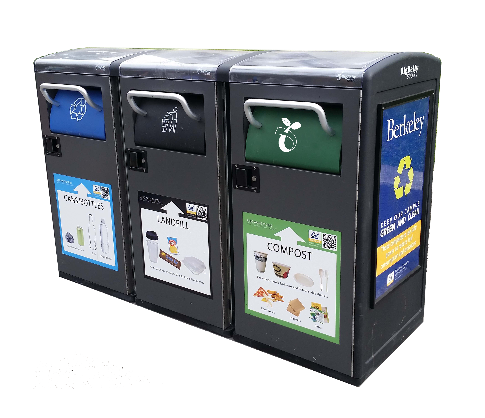

# Big Belly Smart Bin Forecasting

Forecasting system for UC Berkeley's Big Belly smart bin fleet. Predicts time-to-collection-threshold per bin, classifies collection frequency, and produces a rolling weekly operational forecast with calibrated uncertainty bounds.



---

## Problem

UC Berkeley's Cal Zero Waste division manages ~248 Big Belly compactor bins across 90 campus locations. Collection is triggered reactively — either when a bin reaches 60% capacity or after 7 days. Analysis of 59,111 collection events (Jan 2023 – Feb 2026) shows **35.1% of all collections are wasted trips**, with average bin fullness at collection of 47.1%. The goal is to predict *when* each bin will next need service so that dispatch can shift from reactive alert-response to proactive scheduling.

---

## Dataset

- **Source:** Big Belly CLEAN Management Console (export-only; raw files excluded from repo)
- **Size:** 59,111 collection events, 248 bins, 90 locations, 3 waste streams
- **Date range:** January 2023 – February 2026
- **Features per event:** bin serial, location, stream type (Landfill / Compostables / Recyclables), collection reason, fill level at collection (20% increments), timestamp
- **Key constraint:** fill level is only observable at collection time, in coarse 20% increments — no continuous telemetry

Supplementary features built from external sources:
- UC Berkeley academic calendar (semester dates, spring recess, move-in week)
- Cal Bears football home game schedule (2023–2025)
- Daily weather via Open-Meteo API (temperature, precipitation, wind)

---

## Models

### Fill-Curve Model (analytical)
Per-bin nonlinear curve fitting on (elapsed hours, fill level at collection) pairs. Sigmoid selected for 82% of bins. Analytically solves for T* = time until bin reaches 60%. Used for near-term urgency assessment (0–48h window).

- 5 curve types evaluated: sigmoid, saturating exponential, power law, logarithmic, linear
- Mean R² = 0.23 (reflects 20% quantization noise, not model inadequacy)
- Outputs: `hours_to_full`, `frequency_class` (multi-visit / once-a-week / rarely-full)

### LightGBM Quantile Regression
Cross-bin tabular model. Target: `hours_to_next_collection`. Produces P10/P50/P90 estimates per bin.

| Model | MAE (hours) | RMSE (hours) |
|---|---|---|
| Naive baseline (DOW median) | 48.3 | 65.8 |
| LightGBM Q50 | 40.3 | 54.3 |

**Calibration:** Raw P10–P90 coverage was 59% (target: 80%). Applied split conformal calibration using 2024 H2 as a held-out calibration set. Correction factor: +/- 17 hours. Post-calibration coverage: **80.8%**.

### XGBoost Binary Classifier
Predicts: is this bin currently at or above 60% fill? Class imbalance handled via `scale_pos_weight`. Threshold tuned for recall.

| Threshold | AUC | Precision | Recall |
|---|---|---|---|
| 0.50 (default) | 0.857 | 0.77 | 0.74 |
| 0.33 (recall-optimized) | 0.857 | 0.70 | 0.85 |

### Prophet (aggregate demand)
Daily fleet-level collection count forecast by stream type. Weekly + yearly seasonality, 4 exogenous regressors.

| Stream | MAE (collections/day) | RMSE |
|---|---|---|
| Landfill | 7.7 | 10.2 |
| Compostables | 6.8 | 8.6 |
| Recyclables | 6.9 | 9.1 |

### Forecast Reliability by Horizon (LightGBM)

| Horizon | AUC | Precision | Recall |
|---|---|---|---|
| 24h | 0.737 | 0.702 | 0.122 |
| 48h | 0.771 | 0.815 | 0.371 |
| 72h | 0.809 | 0.870 | 0.579 |
| 1 week | 0.871 | 0.904 | 0.948 |

Short-horizon recall is structurally limited by the data collection design. Fill-curve model used for 0–48h window; LightGBM used for 72h+ planning.

---

## Wasted Trip Analysis

The 35.1% wasted trip rate (20,742 events) is decomposed into four categories:

| Category | Count | % of Wasted | Eliminable |
|---|---|---|---|
| Pre-event staging | 4,761 | 23.0% | Partially |
| Frequency mismatch | 3,736 | 18.0% | Yes |
| Unexplained | 12,245 | 59.0% | Yes |
| Age-rule forced | 0 | 0.0% | No |

~77% of wasted trips are potentially eliminable. The unexplained rate has grown from ~8% of all collections in 2023 Q3 to ~29% in early 2026.

---

## Repo Structure

```
bigbelly-forecasting/
├── notebooks/
│   ├── 01_eda.ipynb                      # Exploratory data analysis, wasted trip decomposition
│   ├── 02_fillcurve_forecast.ipynb       # Per-bin nonlinear curve fitting, T*, frequency classification
│   ├── 03_modeling.ipynb                 # All ML models: naive baseline, Prophet, XGBoost, LightGBM quantile; per-bin error analysis; enriched quantile output
│   ├── 04_calibration.ipynb              # Split conformal calibration; computes q_hat = 16.98 hours
│   └── 05_operational_forecast.ipynb     # Rolling daily forecast, urgency bands, calibrated output table
├── data/
│   ├── README.md                         # Data dictionary; raw files excluded
│   └── bin_fill_curve_coefficients.csv   # Per-bin curve coefficients (pre-computed)
├── report/
│   └── main.tex                          # LaTeX source for first-half final report
├── .gitignore
└── README.md
```

---

## How to Run

**Requirements:** Python 3.10+, Jupyter

```bash
pip install lightgbm xgboost prophet openmeteo-requests requests-cache retry-requests pandas numpy scikit-learn matplotlib
```

**Data setup:** Place the three CLEAN export CSVs in the `data/` directory. Files are named:
```
Daily Collection Activity - CLEAN 2024 (1).csv
Daily Collection Activity - CLEAN 2025 (1).csv
Daily Collection Activity - CLEAN 2026 (1).csv
```
Each file has a 10-row metadata header — the notebooks handle this automatically via `skiprows=10`.

**Execution order:**
1. `01_eda.ipynb` — standalone EDA; no dependencies on other notebooks
2. `02_fillcurve_forecast.ipynb` — generates `bin_fill_curve_coefficients.csv`
3. `03_modeling.ipynb` — trains all models; generates `bin_quantile_forecasts_enriched.csv` and `per_bin_error_q50.csv`
4. `04_calibration.ipynb` — computes q_hat correction factor; run after `03`
5. `05_operational_forecast.ipynb` — loads all outputs; applies q_hat; produces `operational_forecast_full.csv`

Weather data is fetched automatically from the Open-Meteo API on first run and cached locally.

---

## Key Results Summary

- **35.1%** of collections are wasted trips; **~77%** are potentially eliminable
- LightGBM Q50 reduces prediction error **16%** over naive baseline (MAE 40.3h vs 48.3h)
- XGBoost binary classifier: **AUC 0.857**, **recall 0.85** at threshold 0.33
- Weekly planning recall: **94.8%** — reliable basis for 7-day scheduling
- P10/P90 uncertainty bounds calibrated to **80.8% empirical coverage** via split conformal calibration
- Frequency classification: 25% of bins need multiple collections/week; 59% need ~1/week

## Urgency Band Definitions

| Label | Condition |
|---|---|
| OVERDUE | Current fill ≥ 60% — collect immediately |
| MONITOR | No curve fit, or curve asymptote < 60% — bin rarely reaches threshold |
| HIGH | Calibrated P10 ≤ 1 day — collect within 24 hours |
| ELEVATED | Curve estimate ≤ 3 days |
| MODERATE | Curve estimate ≤ 5 days |
| LOW | Curve estimate > 5 days — no collection needed this week |

Conditions evaluated in priority order top to bottom.

## Acknowledgments

This project was completed as part of IND ENG 180 (Industrial Engineering Capstone) at UC Berkeley. We thank Samantha Bunke (Zero Waste Specialist, Cal Zero Waste) for providing data access and operational guidance, and Professor Candace Yano for advising the project.
